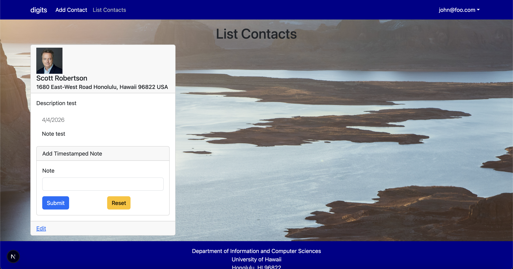
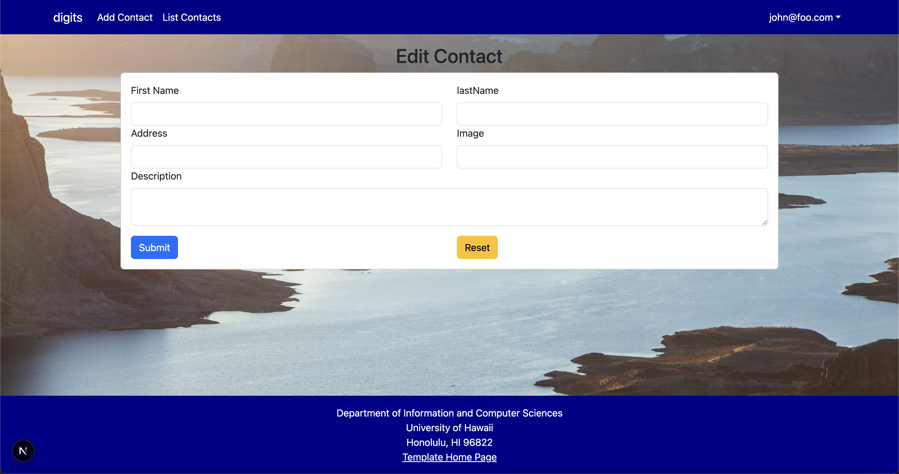

# Digits App


Digits is an application that allows users to:

- Register an account.
- Create and manage a set of contacts.
- Add a set of timestamped notes regarding their interactions with each contact.

---

## Installation

1. **Install PostgreSQL**  
First, [install PostgreSQL](https://www.postgresql.org/download/) for your operating system. Make sure you set a password for your PostgreSQL user (e.g., `postgres`).

Then, create a new database for your application:

```bash
$ createdb digits
$ Password: <your_postgres_password>
```

2. Go to your GitHub repository for this project and clone it to your local machine
```bash
$ git clone https://github.com/YOUR_USERNAME/digits.git
$ cd digits
```

3. Install dependencies
```bash
$ npm install
```

4. Configure environment variables
Create a .env file from the sample:
```bash
$ cp sample.env .env
Edit .env to include your database URL
DATABASE_URL="postgresql://postgres:<your_postgres_password>@localhost:5432/digits?schema=public"
```

5. Set up Prisma
```bash
$ npx prisma migrate dev
$ npx prisma generate
```
This will create your database tables and generate Prisma Client in the generated/prisma directory.

6. Seed the database
```bash
$ npm run seed
```

7. Run the application
Start the development server:
```bash
$ npm run dev
```
Open http://localhost:3000 in your browser. You can log in using the credentials in config/settings.development.json or register a new account.

## User Interface Walkthrough

### Landing Page

When you first bring up the application, you will see the landing page that provides a brief introduction to the capabilities of Digits:


---

### Add Contact

Clicking on the "Add Contact" link brings up a page that allows you to create a new contact:


---

### Register & Sign In

If you do not yet have an account on the system, you can register by clicking on “Login”, then “Sign Up”

Click on the "Login" link, then the "Sign In" menu item to bring up the Sign In page, which allows you to login:

---

### List Contacts

Clicking on the "List Contacts" link brings up a page that lists all of the contacts associated with the logged-in user:



From this page, you can also view and add timestamped notes for each contact.

---

### Edit Contact

From the List Contacts page, the user can click the "Edit" link associated with any contact to bring up a page that allows the contact’s information to be updated:



---

### Admin Mode

It is possible to designate one or more users as “Admins” through the settings file. When a user has the Admin role, they get access to a special navbar link that retrieves a page listing all contacts from all users:

---
